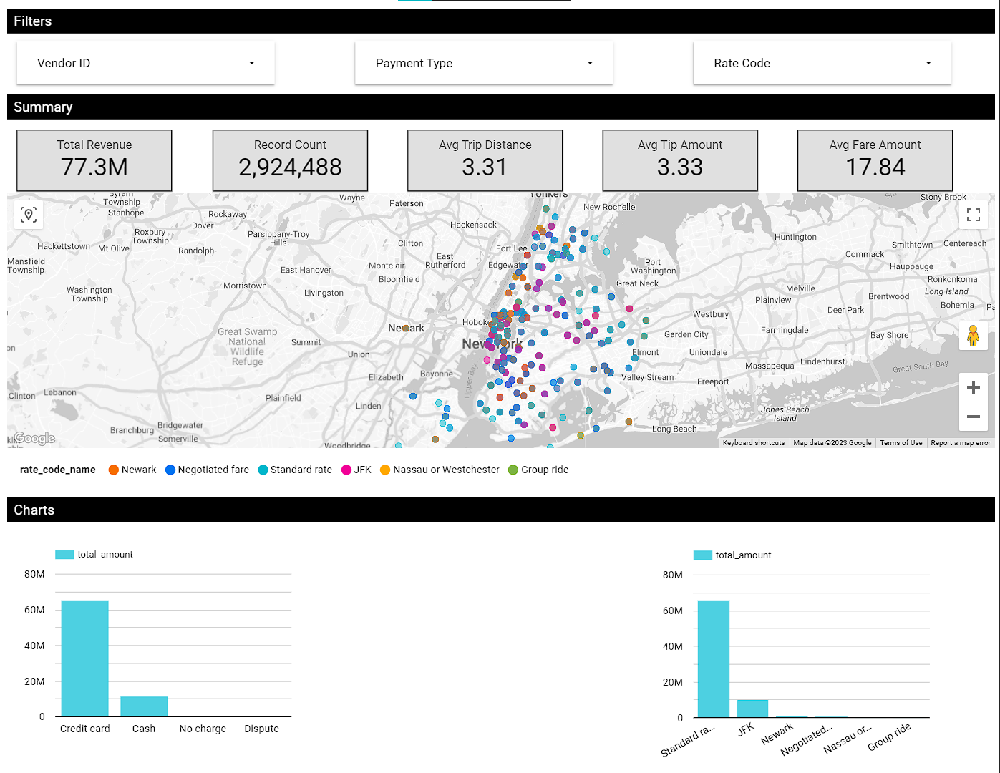

# NYC Taxi Analytics | Modern Data Engineering GCP Project

## Project Description

The goal of this project is to perform data analytics on the NYC Taxi dataset using Google Cloud Platform. The project is divided into 3 parts:

1. Data Ingestion
2. Data Processing
3. Data Visualization

## Architecture

## Tech Stack

1. Google Cloud Storage for storing raw data
2. Google Compute Engine for running Mage.ai
3. BigQuery as the data warehouse for storing processed data
4. [Mage.ai](https://www.mage.ai/) is data pipeline tool for transforming and integrating data
5. Looker Studio for data visualization

## Dataset Used

The dataset used for this project is the [New York City Taxi and Limousine Commission (TLC)](https://www1.nyc.gov/site/tlc/about/tlc-trip-record-data.page) dataset.

## Dashboard

